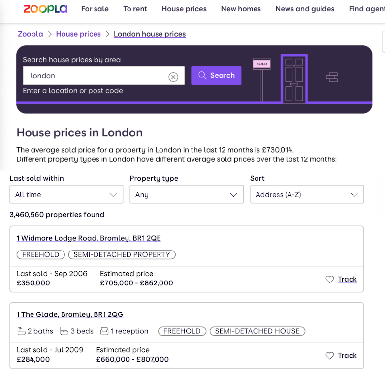
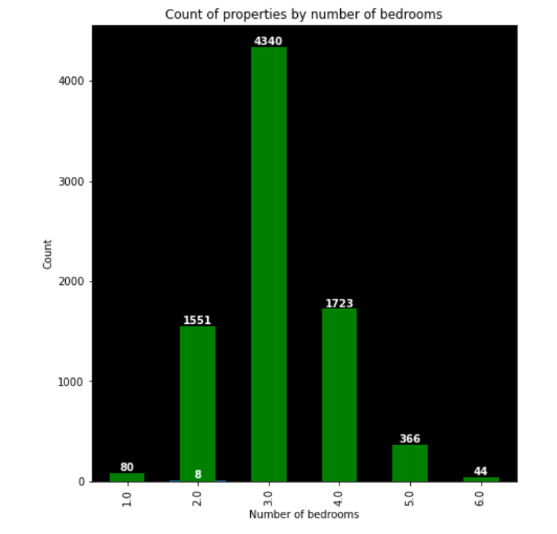
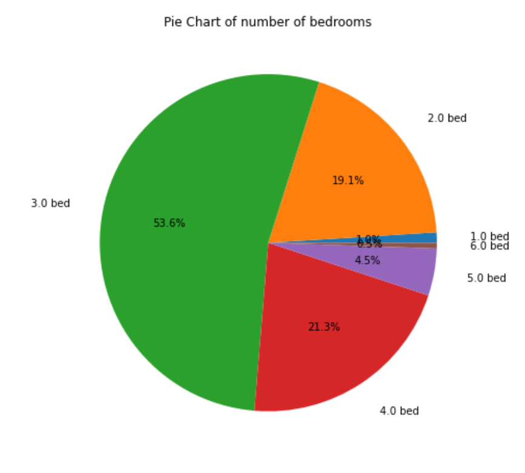

#  

# 🏠 Predicting Property Prices Using Webscraped Data from Zoopla 📈

## Overview

This project was completed as part of the General Assembly Data Science Immersive bootcamp. This document discusses the problem, hypothesis, methodology and conclusions made.

## Repository Contents

- Notebooks
- Images
- Models
- ReadMe

n.b. data files have not been included

## ⚠️ Problem Statement ⚠️

Property buyers face a common question when searching for a home to buy in a given area: "Am I purchasing at the market rate and ideally can I find a bargain?" 

It has never been easier to find information about properties for sale online. Popular online property websites such as RightMove, OnTheMarket and Zoopla all have large historical datasets of finalised sale prices as well as useful information about the type of property and number of rooms inside. However tools to summarise the marketplace easily are less widely utilised.

Buyers who want to get an accurate view of current market rates for a particular area and size of property will often end up doing their own research trying to get a sense of local averages and face the same hurdles when seeking information on comparible properties. 

The aim of this project is to see if we can predict a property's price based on certain publicly available characteristics about the property and to create a tool that can help simplify getting an objective view of the current market. 

☑️ Objectives
------
1. Collect a broad dataset from Zoopla.co.uk of historical prices and any relevant details about those properties
2. Create a price prediction model based on the dataset which will accurately predict the agreed sale price for a given property.
3. Use this tool to identify properties which are currently listed for sale and which may be undervalued.

## Hypothesis

## Data Acquisition

### 🏚 Historical Data acquisition 💷

##### Libraries Used:

- BeautifulSoup
- Requests

 Acquiring data for this project required the use of webscraping techniques. Python's BeautifulSoup library was primarily used to create a crawler which would go to every page of the historical properties listed in a search for 'London'. Information for each listing was collected using the HTML tag structure of the page. 

    

**Information gathered for each property included:**

1. the property type (apartment, semi-detached house etc.)
2. number of bedrooms, bathrooms and lounges
3. the last sale price and which month and year the sale took place 
4. the exact address and postcode of the property

#### 🤖⌨️ Evading Captcha - A VPN Solution 👨🏻‍🦰 

A common difficulty with web scraping is being blocked by CAPTCHAs. These block the website content and require a puzzle to be solve that is typically only possible for a human. This can stop the web scraping program in its tracks.

    

**Minimising the disruption**

I created some code which would automatically find the available servers to my VPN provider and then use command line instructions to switch to a randomly selected server. The Zoopla webpage is then reloaded and to the server it should appear that an entirely new user is accessing the website.

### 🏡 Current Property Listing Data acquisition 💷

A second web scraper was coded to access current property listings using a mixture of Beautiful Soup and Selenium. 

### 🙋🏻‍♀️ What is Selenium? 🤔
Selenium is a website testing tool which can be co-opted for webscraping too. Unlike Beautiful Soup, it allows programs to actually interact with dynamic parts of a webpage (typically controlled by JavaScript) such as buttons, to reveal hidden content or parts of a page which are loaded in later than the core HTML content. 

### 🛑 Scrapping the scrape 🛑 

Whilst this method of scraping did yield a program that could automatically click on the required interactable elements of each page, the program would run more slowly than suitable for the timeframe of the project, taking on average 5 - 10 seconds per page. Given the number of pages required to be scraped this would have taken longer than was avaiable. 

## 🧹Data Cleaning & Exploratory Data Analysis (EDA)🔍 

Cleaning the raw data from Zoopla to be useable for Python analysis involved the following steps:

- Splitting postcode from main address 

| Full Address |
| --------------------------------- |
| 123 Example Street, NW8 7RJ |

| Street Name | Postcode |
| ------------------ | ------- |
| 123 Example Street | NW8 7RJ |

    
- Splitting postcode into first half and second half

| Full Postcode |
| ------- |
| NW8 7RJ |

|1/2 Postcode | 2/2 Postcode|
| --- | --- |
| NW8 | 7RJ |

- Removing pound signs (£), commas (,) from any prices to leave only digits.

|Price Text String | Price Integer |
| --- | --- |
| £1,000,000.00 | **1000000** |
    
    
- Turning the Date Last Sold from text to a datetime format.
    
|Month Year Sold | Datetime Sold |
| --- | --- |
| Sep 2020 | **01/09/2020** |
    
-  Some properties scraped from Zoopla would have data missing about the number of bathrooms or the last sale price etc. These were simply dropped from the dataset

### Feature engineering - GEOCODING

Geocoding is the process of converting a textual address to longitude and latitude numerical data. To do this I used the Google Maps API with Python to obtain exact coordinates of my properties, this allowed me to visualise where properties were located later on.

### 🔤 It's as easy as ABC...unfortunately ❗️
 
It was only at the EDA stage that I identified a slight setback in my dataset. Zoopla when queried for properties in London had returned addresses alphabetically ordered by their postcodes. 

This meant although I had managed to scrape 350,000 properties (out of a total 3.5 million in their database) all of these properties were located in postcodes beginning with the letters A to D. 

### Compromising to a Solution and limiting the dataset for modelling  

### 1.📍🗺 Limiting the Data Set to just Bromley and Croydon

I decided to use the data that I had for the project to limit my model to postcodes from BR - CR which corresponded to a contiguous collection of all addresses from Bromley to Croydon in South East London. Whilst this would mean I wouldn't have the one stop solution for all property purchasers in London that I had hoped for, it wasn't too much of a setback as I could still create a good proof of concept based on this narrower geographical region which I intend to scale up once I have had the 3 weeks or so that I need to run my scraper to collect all 3.5 million London properties! 

### 2. ⛔️⏳**Only include Freehold sales in final dataset**

***A quick note on Leasehold vs Freehold property sales***

UK property law defines two classes of property owner. Freeholders are the ultimate owner of a property. They have the right to sell the leasehold to their property for a fixed number of years, this can range from decades to hundreds of years.

***Freehold only***

Unfortunately Zoopla historical sales did not distinguish the number of years of lease that properties were sold for. This has a huge impact on the sale price of a given property and therefore I decided to only include sales categorised as being FREEHOLD in my final dataset, the assumption being that the full value of the property is being incorporated in the agreed price.

### 3. **Only include sales made in 👉 2021 and 2022  👈** 

To avoid turning the problem into a timeseries prediction only properties where the last sale price had been made in 2021 or later were included. An assumption made here is that property prices will not have changed much since then and reflect the current market. 

## Data Visualisation 

### ❌ Removal of outliers using IQR

Property prices can contain outliers for various reasons:
- One-of-a-kind or architecturally unique properties
- Very rare to have more than 6 bedrooms in a property
- Unique sale conditions

I opted to remove outliers using the cutoffs of anything below the 1st Quartile - (1.5 x IQR) and anything about 3rd Quartile + (1.5 x IQR) where IQR is the Interquartile Range. 

This was appropriate as property prices displayed a long right tail where most of the prices were to the left of the mean price but there were a few very expensive outliers.

In the end I also excluded properties with more than 5 bedrooms as the dataset contained too few of these with the vast majority falling between 1 and 5.

The goal of these steps was to help my model generalise to the sorts of properties that are most widely available on the market.

Boxplots of Sale Price before outlier removal

Boxplots of Sale Price after outlier removal

### Mean/Median plot of prices by number of bedrooms

After outlier removal I created some visualisation showing descriptive stats about the properties under investigation.

### [Tableau Visualisation by location](https://prod-uk-a.online.tableau.com/t/oscarmumford/views/Grouped_area_bromley_croydon/AveragePriceDashboard2/0fdf8807-798a-468e-8cf3-cdbb8c32d0d3/1549b4fc-ddef-4c25-b1e9-2a2bb37029d9?:display_count=n&:showVizHome=n&:origin=viz_share_link)

To better visualise my data geographically I created dashboards (interactive charts) using Tableau software and shared them online.

#### Spread of addresses colour coding by postcode

These were plotted in Tableau using the geocoded coordinates created earlier.

#### Interactive dashboard displaying average price by postcode and by number of bedrooms 

Please follow the link to interact with my [Tableau Visualisation showing average prices by postcode](https://prod-uk-a.online.tableau.com/t/oscarmumford/views/Grouped_area_bromley_croydon/AveragePriceDashboard2/0fdf8807-798a-468e-8cf3-cdbb8c32d0d3/1549b4fc-ddef-4c25-b1e9-2a2bb37029d9?:display_count=n&:showVizHome=n&:origin=viz_share_link) directly where you can control the number of bedrooms and see average prices.

### Historical Price Change 

For a high level view of what I had scraped I used my full historical dataset including non-freehold sales and those last sold between 2022 and 1995 to visualise how property prices had changed in that time. The average increases broadly agree with other analysts results for this period. 

### Dataset split by bedrooms

Next I took a look at the actual split of my final dataset for Bromley & Croydon Freehold Sales in 2021-2022. By far most sales were 3 bedrooms, this may reflect a tendency for freehold properties to be purchased when people are starting families and a bit more established in their careers rather than reflecting how many of each property is being sold generally on the leasehold market.

  
   

### Histogram of Sale Price By Bedrooms

### Logarithm of last sold price after outlier removal

Although not perfectly normally distributed our cleaned dataset should be suitable for modelling in the next step.

## Modelling

## Predictor and estimators

Data was split into the following modelling features and with Sale Price as the target predictor.

|Features||||||
|-|-|-|-|-|-|
|Bedrooms  |Bathrooms |Lounges | Property Type | Postcode Full | Postcode First Half|

|Predictor|
|---------|
|Sale Price GBP|

## Modelling preprocessing
The dataset was then processed in the following ways:
1. Dummification of postcodes. This created column for each unique postcode with a value of 1 (if the property is in that postcode) and 0 if the property is not.
2. Dummification in this case created many more zero valued cells than not. To improve efficiency of modelling the dataset was converted from a Pandas dataframe to a Sparse Matrix.
3. Data was split into a Training Set (80%) which would be used to create the model and Testing Set (20%) which would be used to validate the model against unseen data.
4. Data was standarised to the mean using the Standard Scaler class from Scikit Learn. 
5. 5 K-Folds were used throughout when training and generating mean CV scores.

## Results

Python Modules used:
- Scikit Learn

For modelling a variety of regression models in Python's Scikit Learn module were used to predict the sale price.

The following models were fit:
|Model|Train Score| Mean CV  Score| Test Score |
|-----|--|-|-|
|Linear Regression|
|Ridge Regularisation (α=0.54)| 0.90| 0.64| 0.78
|Lasso Regularisation|
|Elastic Net Regularisation|
|Decision Tree Regressor|
|Random Forest Regression| 0.96 | 0.69 | 0.74

 Regularisation models as well as the Decision Tree and Random Forest were fit using Scikit Learn's GridSearchCV class in order to optimise the  hyperparameters and improve scoring.

### Scores
 
Best scores were achieved with the Random Forest Regressor and Ridge Regularisation. 

### Coefficient Analysis

I analysed the most impactful coefficients generated from the regression after regularisation with Lasso. Certain postcodes had an outsized effect but unsuprisingly Bedrooms, bathrooms and lounges were amongst those with the largest affect on the final price.

#### Analysis of Errors 

Shows a normal distribution of error meaning which satisfies the requirements for accurate price prediction with regression techniques

## Decision Recommendations 

## Conclusions 

Using Linear regression with Ridge Regularisation a best  model test score of 0.77 was achieved. This means that our predictors alone captured 77% of the mean squared error in the dataset. 

Whilst we can consider this to be a strong model given the relatively  few property characteristics in our predictors, 23% putstoo great of an uncertainty around our predictions to give us much confidence in deciding whether a property is undervalued or not. 

Generally the London property market is considered to be mature meaning prices are quite rigid and fluctuation around the true price is not likely to be more than a few percentage points. Therefore we might be justified in assuming this will not be very accurate in identifying undervalued listings. We would need the listing to be very low compared to our prediction to have much confidence in claiming it was undervalued. 

## Limitations and Areas of Improvement

### Too few features

My model was limited by the few number of features we could rely upon for modelling. Instinctively most people know that how they value a property will rely on many more factors than merely the number of rooms, the quality and size of those rooms plays a big part. If square footage could be calculated this would go a long way to improving the model. However in the UK this information does not appear to be readily available. On certain listings there are however blue prints included in image file format. It could certainly be interesting to attempt to use a program perhaps using optical character recognition to get the size of the property.

I also would like to add more granular detail about the properties and their areas from public sources such as crime statistics using the police API or calculate whether a property is North or South facing using coordinate data.

### Does not take into account trends

For this model I used a snapshot of prices with only those properties sold since 2021 and assumed this reflected a constant level in the market. In reality property prices change over time and I would like next to model my dataset using timeseries techniques (e.g. ARIMA) to see changes over time.

### Small Dataset

The dataset used was relatively small at ~8000 properties. This was because only a few had actually been sold freehold. I am currently working to scrape all 3.5 million properties available on Zoopla which will take an estimated 3 weeks of continuous scraping. I intend to rerun my modelling then to see if this provides a greater predictive power.

## Contact
Thanks for taking the time to look at my project!  

If you found this project interesting and would like to reach out the best place to message me is on [LinkedIn](https://www.linkedin.com/in/oscar-mumford/) or by [email](mailto:oscaromumford@gmail.com). 

